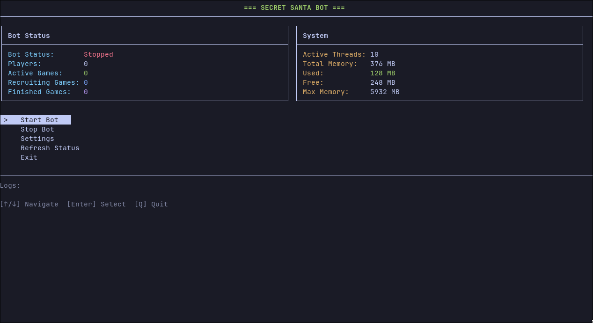

# Secret Santa Bot

A Telegram bot for organizing Secret Santa gift exchanges. Comes with a built-in terminal UI for server management.



## Features

- Create games with scheduled start/end dates
- Share invite links for players to join
- Wishlists for each participant
- Automatic random pairing (guaranteed no self-assignments)
- Anonymous messaging between Santa and giftee
- Multi-language support: English, Russian, Czech, Ukrainian, Uzbek, Kazakh

## Requirements

- Java 21+

## Build

```bash
./gradlew shadowJar
```

The fat JAR will be at `build/libs/SecretSantaBot-*-all.jar`.

## Run

```bash
java -jar build/libs/SecretSantaBot-*-all.jar
```

On first launch, go to **Settings** in the TUI to enter your Telegram bot token and username (obtained from [@BotFather](https://t.me/BotFather)).

## Configuration

All settings are stored in a local SQLite database (`data/santabot.db`), created automatically on first run. No external configuration files needed.

## License

[Apache License 2.0](LICENSE)
